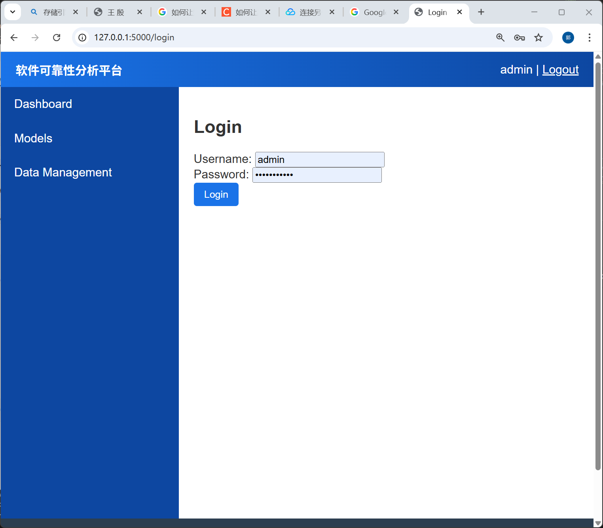
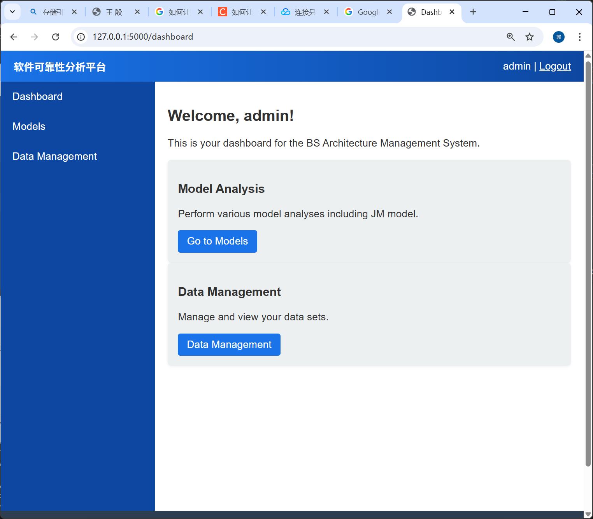
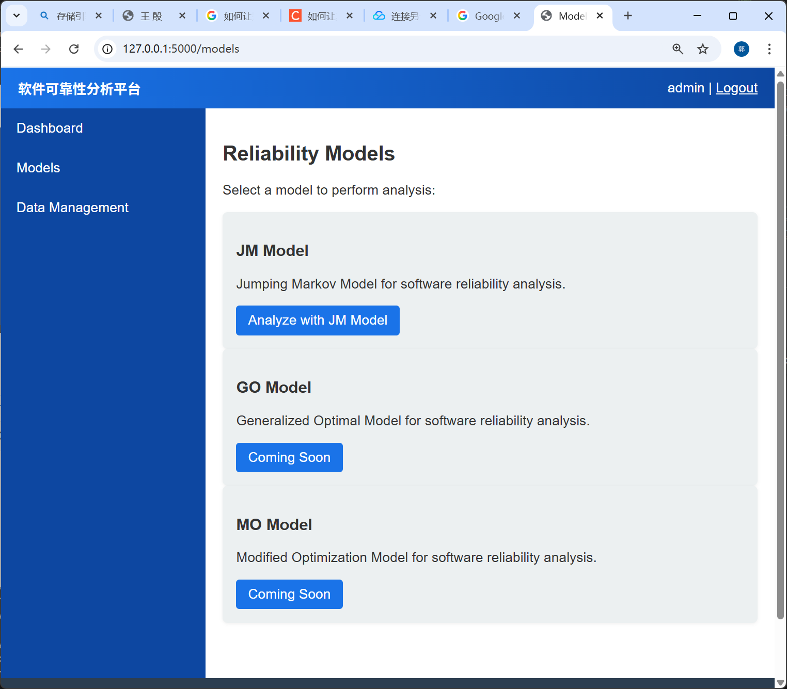
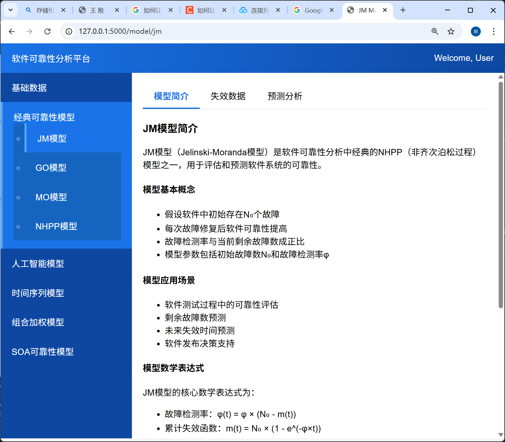

# 可靠性分析工具

## 登录

账号：admin
密码：password123

## 运行环境

- Python 3.8+（已在项目中用 Python 3.13 测试）
- 依赖库：numpy, matplotlib, flask（如果运行 web 服务）

## 如何启动后端服务

在项目根目录下执行：

```powershell
python app.py
```

服务默认在 `http://127.0.0.1:5000` 启动。

## API 快速调试示例

- 预测接口：`POST /api/jm/predict`
  - JSON 请求示例：

```json
{
  "data_type": "custom",
  "prediction_step": 5,
  "ex": 0.001,
  "ey": 0.001,
  "train_data": [9,12,11,4,7,2,5,8]
}
```

## 界面模型展示

### 登录界面

>http://127.0.0.1:5000/login
>
>


### 菜单

> http://127.0.0.1:5000/dashboard
>
> 

###  模型

> http://127.0.0.1:5000/models
>
> 


#### JM模型
> http://127.0.0.1:5000/model/jm
>
> 

>失效数据可以自定义 但没有进行数据持久化（没存储）
